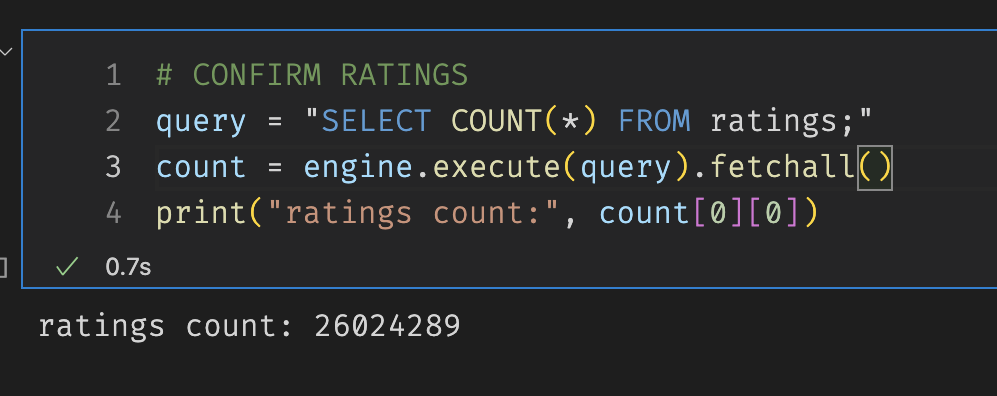

- [Extract, Transform and Load Movie Data.](#org62cdcf7)
  - [Overview](#org46439d5)
  - [Results](#org805d055)
    - [Query of the Movies table](#orgb27ac67)
    - [Query of the Ratings table](#org4001f7c)
  - [Summary](#org906207b)
  - [Closing Thoughts](#org4d34d58)


<a id="org62cdcf7"></a>

# Extract, Transform and Load Movie Data.


<a id="org46439d5"></a>

## Overview

In this analysis, we mainly focused on the heuristics of the ETL process. We were able to clean data thoroughly and get a better view of our data using Python and SQL to load the results into a database.

As this is our first time dealing with this amount of data in this fashion, we used a very procedural approach to make sure all our steps were correct. At the same time, we created a few functions to reuse in future endeavors.


<a id="org805d055"></a>

## Results

We managed to store the data in our SQL database by connecting to it through Python.

```python
from sqlalchemy import create_engine

db_dns = "postgresql://albertovaldez@localhost:5432/movie_data2"
engine = create_engine(db_dns)
query = "SELECT COUNT(*) FROM movies;"
count= engine.execute(query).fetchall()
print(count)
```

    [(6051,)]


<a id="orgb27ac67"></a>

### Query of the Movies table

 We can also use the basic SQL queries from terminal or any SQL supporting environment.

```sql
SELECT COUNT(*) FROM movies;
```

<table><tr><th>count</th></tr><tr><td>6051</td></tr></table>

```sql
SELECT index, imdb_id FROM movies ORDER BY index DESC LIMIT 5;
```

<table><tr><th>index</th><th>imdb_id</th></tr><tr><td>6051</td><td>tt3859310</td></tr><tr><td>6050</td><td>tt5795086</td></tr><tr><td>6049</td><td>tt6304162</td></tr><tr><td>6048</td><td>tt5390066</td></tr><tr><td>6047</td><td>tt5639354</td></tr></table>


<a id="org4001f7c"></a>

### Query of the Ratings table




<a id="org906207b"></a>

## Summary

The most important part was joining our two tables where we made a few key judgements on the tables we wanted to keep and which one were not worth to join.

| Wiki                                  | Movielens                               | Resolution                             |
|------------------------------------- |--------------------------------------- |-------------------------------------- |
| title<sub>wiki</sub>                  | title<sub>kaggle</sub>                  | DROP WIKIPEDIA                         |
| running<sub>time</sub>                | runtime                                 | KEEP KAGGLE, FILL ZEROS WITH WIKIPEDIA |
| budget<sub>wiki</sub>                 | budget<sub>kaggle</sub>                 | KEEP KAGGLE, FILL ZEROS WITH WIKIPEDIA |
| box<sub>office</sub>                  | revenue                                 | KEEP KAGGLE, FILL ZEROS WITH WIKIPEDIA |
| release<sub>date</sub><sub>wiki</sub> | release<sub>date</sub><sub>kaggle</sub> | DROP WIKIPEDIA                         |
| language                              | original<sub>language</sub>             | DROP WIKIPEDIA                         |
| Production company(s)                 | production<sub>companies</sub>          | DROP WIKIPEDIA                         |


<a id="org4d34d58"></a>

## Closing Thoughts

ETL may not be the most comfortable part of the data pipeline but its probably the most crucial. Clean data has become more and more important in the way we solve problems, design programs, and learn about the world.
